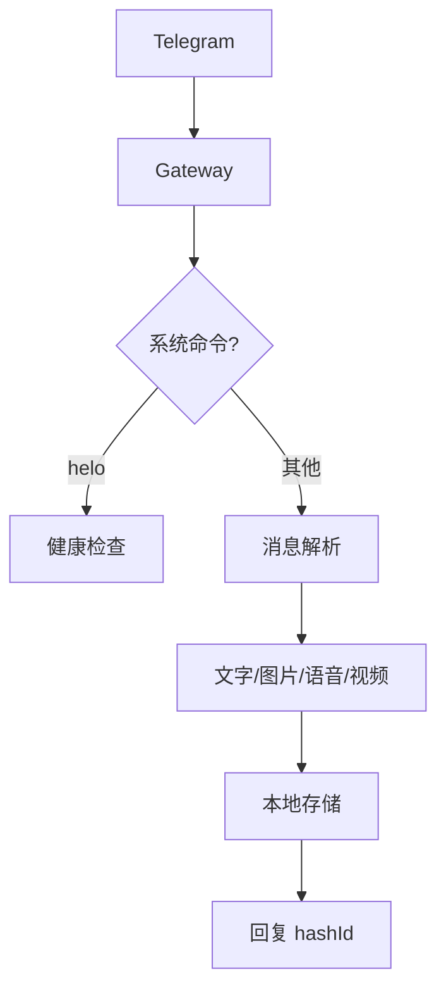

# 系统架构

第一阶段不调用任何模型。

分层：Telegram adapter 只负责更新和回复；Message parser 统一消息模型；Capture service 负责去重、时间戳、用户归属和保存；Storage 负责 SQLite 元数据与媒体文件；Command service 负责确定性命令。所有入口必须调用同一个 capture service。

未来的手动 `/analyze` 流程是：选择明确范围 → 本地脱敏 → Remote LLM → 独立保存派生分析，不能覆盖原始记录。
